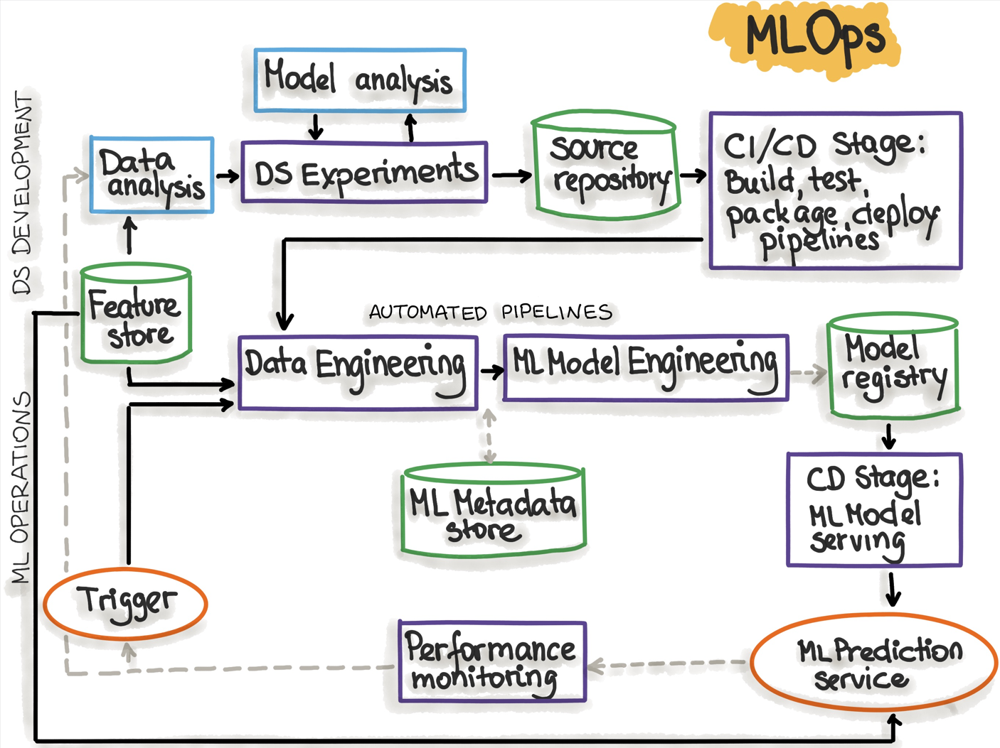
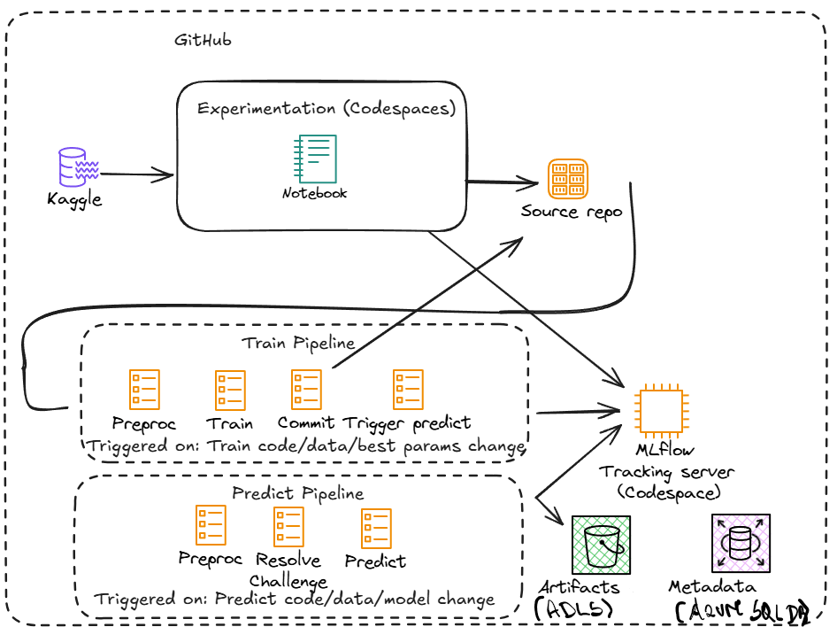
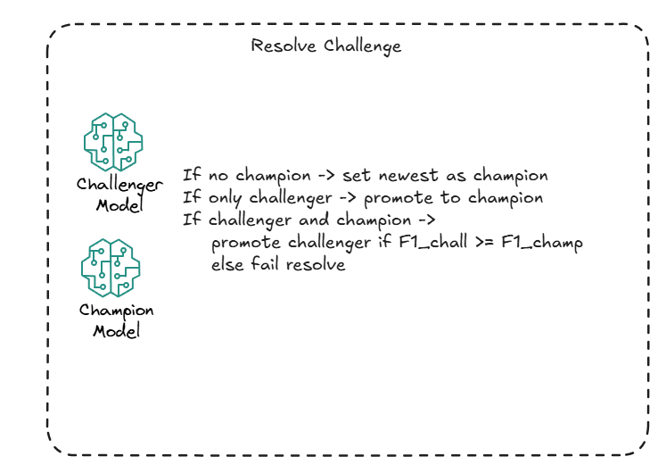

# predict_cholesterol

<a target="_blank" href="https://cookiecutter-data-science.drivendata.org/">
    
</a>

Predicting cholesterol project is the project that serves implementing MLOps purpose. In the project organization there is the repo structure is described.

## Project Organization

```
├── LICENSE            <- Open-source license if one is chosen
├── Makefile           <- Makefile with convenience commands like `make data` or `make train`
├── README.md          <- The top-level README for developers (also about the solution architectre) using this project.
├── data
│   ├── external       <- Data from third party sources.
│   ├── interim        <- Intermediate data that has been transformed.
│   ├── processed      <- The final, canonical data sets for modeling.
│   └── raw            <- The original, immutable data dump.
│
├── docs               <- A default mkdocs project; see www.mkdocs.org for details
│
├── models             <- Trained and serialized models, model predictions, or model summaries
│
├── notebooks          <- Jupyter notebooks. Naming convention is a number (for ordering),
│                         the creator's initials, and a short `-` delimited description, e.g.
│                         `1.0-jqp-initial-data-exploration`.
│
├── pyproject.toml     <- Project configuration file with package metadata for 
│                         ARISA_DSML and configuration for tools like black
│
├── references         <- Data dictionaries, manuals, and all other explanatory materials.
│
├── reports            <- Generated analysis as HTML, PDF, LaTeX, etc.
│   └── figures        <- Generated graphics and figures to be used in reporting
│
├── requirements.txt   <- The requirements file for reproducing the analysis environment, e.g.
│                         generated with `pip freeze > requirements.txt`
│
├── setup.cfg          <- Configuration file for flake8
│
└── ARISA_DSML   <- Source code for use in this project.
    │
    ├── __init__.py             <- Makes ARISA_DSML a Python module
    │
    ├── config.py               <- Store useful variables and configuration
    │
    ├── dataset.py              <- Scripts to download or generate data
    │
    ├── features.py             <- Code to create features for modeling
    │
    ├── modeling                
    │   ├── __init__.py 
    │   ├── predict.py          <- Code to run model inference with trained models          
    │   └── train.py            <- Code to train models
    │
    └── plots.py                <- Code to create visualizations
```

--------

## Prerequisites

## MLOps Architecture
The repo code implements the general MLOps architecture in the below diagram:


(source https://ml-ops.org/content/mlops-principles) More specifically, an MLflow tracking server is hosted in a Codespace, and running the two pipelines in GitHub Actions Workflows, see architecture below:



The main change comparing to the originally proposed solution is that the Mlflow Artifacts and Metadata are stored in Azure Cloud (ADLS and Azure SQL Database) .

## Getting the architecture up and running

At the beginning, the author wanted to use the dataset which was exposed by the another teacher on other lecture. Therefore new dataset was added to the kaggle account and it was used to train the model. Training itself isn't sophisticated but the idea was to have the whole workflow up and running.

Since we will be using Azure Storage Account (ADLS Gen2) to host the MLflow artifact stor, there will be a need to create and set this up in Azure.
There could be the Azure Free subsription for students used for this purpose. Because this subscription is the university one, the regular user doesn't have access to the MS Entra and therefore it's not possible to make the app registration but the user assigned managed identity with federation was used for this purpose. There was a need to create the UAMI, add him access to the proper resources (ADLS & Azure SQL DB) and create federations for the current repository. 

### Metadata store database
Azure SQL DB was used to run the MLFlow instance

### Artifact store
As mentioned above ADLS was used for this purpose. There was a configuration on the IAM done so that UAMI is the Storage Contributor (it has permissions to write to the storage)

### GitHub Secrets setup


